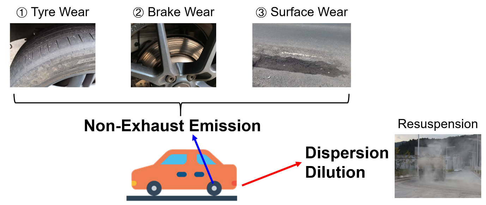

# Non-Exhaust Emissions and Dispersion

Recent studies from the UK and Europe equally documented the main sources of non-exhaust emissions such as tyre wear, brake wear, and road surface wear [@AirQualityExpertGroup2019; @EMEP/EEA2019]. A few papers included resuspension as a fourth contributor, but this study articulates resuspension in the dispersion section below. Figure \@ref(fig:nee) illustrates the non-exhaust emissions, dispersion, and dilution.

```{r nee, echo=FALSE, out.width="80%", fig.cap="Graphical explanation of non-exhaust emissions, dispersion, and dilution", fig.align = 'center'}

```

According to @EMEP/EEA2019, the total of non-exhaust emissions is estimated with the following equation \@ref(eq:nee-total).

\begin{equation}
(\#eq:nee-total)
NEE_{total}=NEE_{Tyre}+NEE_{Brake}+NEE_{Road}
\end{equation}

* NEE~Total~: the total non-exhaust PM emissions
* NEE~Tyre~: PM emissions from tyre wear
* NEE~Brake~: PM emissions from brake wear
* NEE~Road~: PM emissions due to road abrasion

Each component will be investigated in the following sections.

## Tyre Wear

\begin{equation}
  NEE_{Tyre}=\sum_{i=1}^{n}N_j \times M_j \times EF_{Tyre,j} \times F_{s,i} \times S(V)
  (\#eq:nee_tyre)
\end{equation}

- NEE~Tyre~: Total emissions for the defined time and spatial boundary (g)
- N~j~: Number of vehicles in category _j_ within the defined spatial boundary
- M~j~: Mileage (km) driven by each vehicle in category j during the defined time _(not used)_
- EF~Tyre~, j: TSP mass emission factor for vehicles in category _j_ (g/km)
- F~s,i~: Mass fraction of particles that can be attributed to particle size class _i_
- S(V): Correction factor for a mean vehicle travelling speed _V_

This equation was designed to measure the bulk emissions from a number of vehicles (e.g. 20g/km from 10 vehicles in a 5km trip between 10:00-15:00). However, it is inappropriate to measure the emissions of vehicles that have separate journeys. To find a solution, this study manipulates N~j~ at an appropriate number based on sensitivity analysis, converts emission levels from g/km to µg/30m (equal to a size of one patch in the simulation), and spatial and temporal units at 30m and on a minute-by-minute basis. For example, one passenger car (j) has an emission factor of .0107 (.0067-.0162) (g/km) (see Table 1), and to get an estimate of PM~10~, the size distribution F~s,i~ converts the TSP estimate to PM~10~ multiplying by a fraction of 0.6 (see Table 2). This can result in 32.1µg/m3 per patch with an uncertainty range of 20.1 - 48.6.


In terms of vehicle speed, EEA sets the parameter V at 1.39 below 40km/h, and declining effect of (-0.00974 * V + 1.78) between 40-90km/h. It assumes that frequent brakes and accelerations are expected below 40km/h but less as the vehicle speeds up. Mileage (M~j~) was not used for this study as this study focuses on the emission and the immediate dispersion of particles, not the activity of vehicles. 

```{r table-emission-factors, echo=FALSE, message=FALSE, warnings=FALSE, results='asis', tab.cap="TSP (Total Suspended Particles) emission factors for source category road vehicle tyre wear [@EMEP/EEA2019]"}
library(flextable)
library(tidyverse)
df <- tibble::tibble(
  `Vehicle class (j)` = c("Two-wheeled vehicles", "Passenger cars", "Light-duty trucks", "Heavy-duty vehicles"),
  `TSP emission factor (g/km)` = c(0.0046, 0.0107, 0.0169, "Separate equation"),
  `Uncertainty range` = c("0.0042-0.0053", "0.0067-0.0162", "0.0088-0.0217", "0.0227-0.0898")
)
flextable(df) %>% autofit()
```


```{r table-emission-particles, echo=FALSE, message=FALSE, warnings=FALSE, results='asis', tab.cap="Size distribution of tyre wear particles [@EMEP/EEA2019]"}
library(flextable)
library(tidyverse)

df <- tibble(
  `Particle size class (i)` = c("TSP", "PM10", "PM2.5", "PM1", "PM0.1"),
  `Mass Fraction of TSP` = c(1, 0.6, 0.42, 0.06, 0.048)
)
flextable(df) %>% autofit()
```

```{r table-speed, echo=FALSE, message=FALSE, warnings=FALSE, results='asis', tab.cap="Speed Correction [@EMEP/EEA2019]"}
library(flextable)
library(tidyverse)

df <- tibble::tibble(
  `Velocity (km/h)` = c("V<40", "40 ≤ V ≤ 90", "V >90"),
  `Factors (V)` = c(1.39, "-0.00974*V+1.78", 0.902)
)
flextable(df) %>% autofit()
```


## Brake Wear
The equation for brake wear is the same as tyre wear and has only a few differences in parameters.

\begin{equation} 
  NEE_{Brake}=\sum_{i=1}^{n}N_j \times M_j \times EF_{Brake,j} \times F_{s,i} \times S(V)
  (\#eq:brake-wear)
\end{equation} 

* NEE~Tyre~: Total emission for the defined time and spatial boundary (g/km)
* N~j~: Number of vehicles in category j within the defined spatial boundary
* M~j~: Mileage (km) driven by each vehicle in category j during the defined time (not used)
* EF~Tyre,j~: TSP mass emission factor for vehicles in category j (g/km)
* F~s,i~: mass fraction of Particles that can be attributed to particle size class i
* S(V): Correction factor for a mean vehicle travelling speed \textit{V}


As mentioned in the tyre wear equation, emission factors for passenger cars must fit a unit set in the virtual environment. Thus, the EF~Br,j~ value of .0075 (g/km) converts to 21.5 (µg/patch). The size distribution of PM~10~ is 0.98. The brake wear, particularly from the linings, are worn out quickly when the driver accelerates and decelerates frequently, and this tends to happen when the traffic volume is high. Again, mileage (M~j~) was not used for this study as this study focuses on the emission and the immediate dispersion of particles, not the activity of vehicles.


```{r table-emission-factors1, echo=FALSE, message=FALSE, warnings=FALSE, results='asis', tab.cap="TSP (Total Suspended Particles) emission factors for source category road vehicle brake wear [@EMEP/EEA2019]"}
library(flextable)
library(tidyverse)
df <- tibble::tibble(
  `Vehicle class (j)` = c("Two-wheeled vehicles", "Passenger cars", "Light-duty trucks", "Heavy-duty vehicles"),
  `TSP emission factor (g/km)` = c(0.0037, 0.0075, 0.0117, "Separate equation"),
  `Uncertainty range` = c("0.0022-0.0050", "0.0044-0.0010", "0.0088-0.0145", "0.0235-0.0420")
)
flextable(df) %>% autofit()
```


```{r table-emission-particles1, echo=FALSE, message=FALSE, warnings=FALSE, results='asis', tab.cap="Size distribution of brake wear particles [@EMEP/EEA2019]"}
library(flextable)
library(tidyverse)

df <- tibble(
  `Particle size class (i)` = c("TSP", "PM10", "PM2.5", "PM1", "PM0.1"),
  `Mass Fraction of TSP` = c(1, 0.98, 0.39, 0.1, 0.08)
)
flextable(df) %>% autofit()
```

```{r table-speed1, echo=FALSE, message=FALSE, warnings=FALSE, results='asis', tab.cap="Speed Correction [@EMEP/EEA2019]"}
library(flextable)
library(tidyverse)

df <- tibble::tibble(
  `Velocity (km/h)` = c("V<40", "40 ≤ V ≤ 90", "V >90"),
  `Factors (V)` = c(1.67, "-0.0270*V+2.75", 0.185)
)
flextable(df) %>% autofit()
```


## Surface Wear (i.e. Road Abrasion)

Road surface wear is caused by the appearance of wheel marks when the vehicle passes over the road or parts of the road are destroyed by heavy vehicles. The formula is as follows.


\begin{equation}
   NEE_{Surface}=\sum_{i=1}^{n}N_j \times M_j \times EF_{SW,j}
   (\#eq:nee_surface)
\end{equation}

*	NEE~Surface~: Total emissions for the defined time and spatial boundary (g)
*	N~j~: Number of vehicles in category j within the defined spatial boundary
*	M~j~: Mileage (km) driven by each vehicle in category j during the defined time (not used)
*	EF~SW,j~ = TSP mass emission factor from surface wear for vehicles in category j (g/km)
*	F~s,i~ = Mass fraction of TSP that can be attributed to particle size class i


```{r table-emission-factors3, echo=FALSE, message=FALSE, warnings=FALSE, results='asis', tab.cap="TSP (Total Suspended Particles) emission factors for source category road surface wear [@EMEP/EEA2019]"}
library(flextable)
library(tidyverse)
df <- tibble::tibble(
  `Vehicle class (j)` = c("Two-wheeled vehicles", "Passenger cars", "Light-duty trucks", "Heavy-duty vehicles"),
  `TSP emission factor (g/km)` = c(0.0006, 0.0015, 0.0015, 0.0076)
)
flextable(df) %>% autofit()
```


```{r table-emission-particles3, echo=FALSE, message=FALSE, warnings=FALSE, results='asis', tab.cap="Size distribution of surface wear particles [@EMEP/EEA2019]"}
library(flextable)
library(tidyverse)

df <- tibble(
  `Particle size class (i)` = c("TSP", "PM10", "PM2.5"),
  `Mass Fraction of TSP` = c(1, 0.5, 0.27)
)
flextable(df) %>% autofit()
```

## Dispersion and Dilution
There are many dispersion models applicable for exhaust emissions, but according to early research [@Beevers2013a; @Panko2013] , many things related to non-exhaust dispersion remain unknown. The University of California, Riverside (UCR) team is conducting an ongoing project to understand the severity of non-exhaust emissions at nearer roads and is currently testing non-exhaust parameters in their existing dispersion model ([link](https://ww2.arb.ca.gov/resources/documents/brake-tire-wear-emissions)). In line with the UCR project, this study also attempts to disperse pollution with a spread function, in-cone in NetLogo, as a surrogate of dust resuspension.


Dilution with non-combustible dust varies by meteorological or ventilation conditions. Less road dust would be generated on rainy days due to the additional weight that is deposited by the particle substances on the ground, and during night hours when there is less traffic. Cities like Seoul have employed water spraying trucks to spray moisture on the roads on dry days, which adheres to the particles on the ground as well as keeps the resuspension low as possible. Since this study does not consider humidity or rain effects, the model will use the case from [@Nikolova2014], where it takes 110 seconds to dilute completely. In NetLogo, this is assigned as three random ticks – ranging between 0-2 minutes. This study further investigates the sensitivity of road PM~10~ by controlling both dispersion ranges and the extension of dilution.


## Application Inside the Simulation
It is worth mentioning that the units change inside the *in silico* environment. Since one patch is equivalent to 30 metres and one car represents 10 vehicles, a car moving from one patch to the next means 10 cars moving 30 metres. The vehicle speed inside the simulation is assigned in Table\@ref(tab:table-netlogo-speed).


```{r table-netlogo-speed, echo=FALSE, message=FALSE, warnings=FALSE, results='asis', tab.cap="Conversion of Vehicle Speed in NetLogo"}
library(flextable)
library(tidyverse)

df <- tibble(
  Original = c("5km/h", "10km/h", "20km/h", "40km/h"),
  Simulation = c(0.25, 0.5, 1, 2)
)
flextable(df) %>% autofit()
```

In published studies, the emissions are calculated by g/km based on the total distance of which the car has travelled [@Srimuruganandam2010;@Ferm2015]. @Smit2010 argued that the atmospheric pollution is combined with emissions, humidity, wind, temperature, and other uncertain factors, and therefore the calibration process is normally tested in places where there are fewer confounding variables, e.g. tunnels. Calibration with observational values can be inaccurate, but more than 15 studies have chosen this method due to restricted conditions [@SMITH2020105188].

