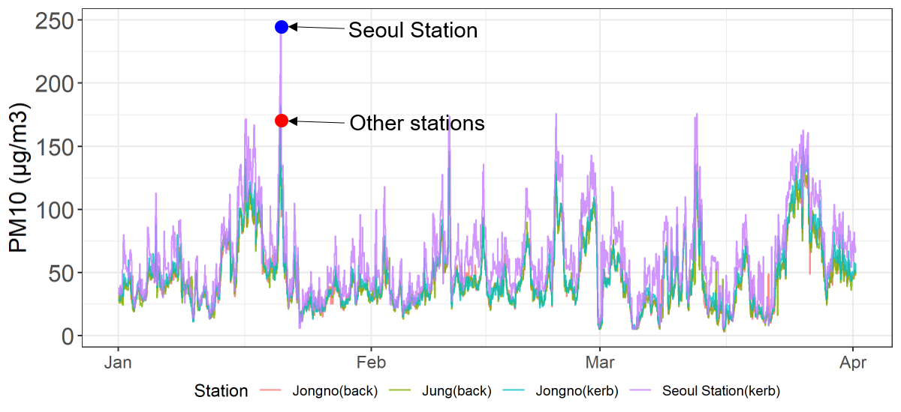
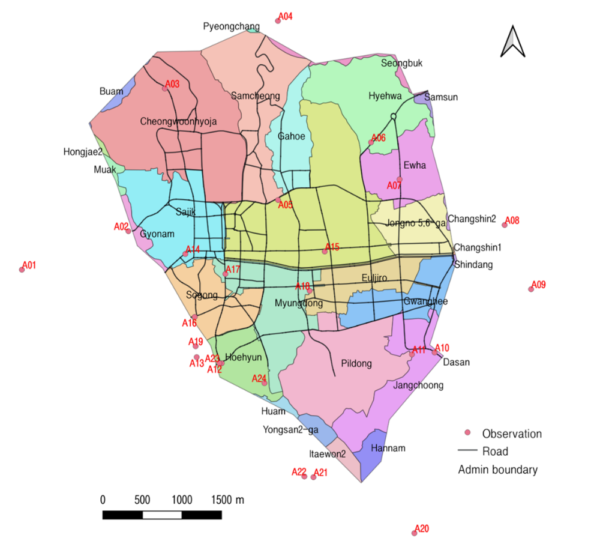
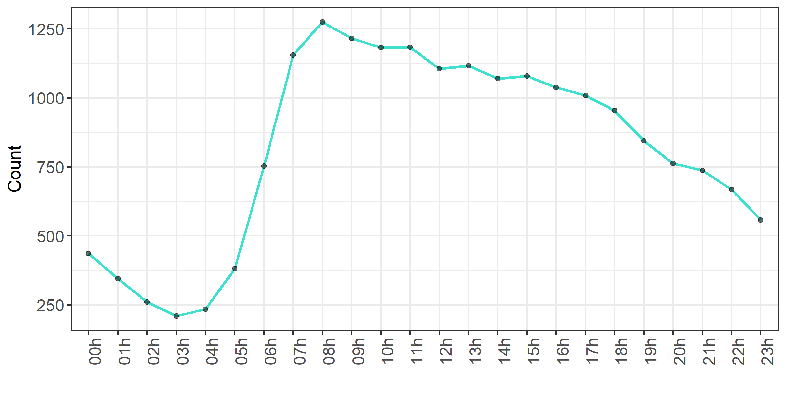
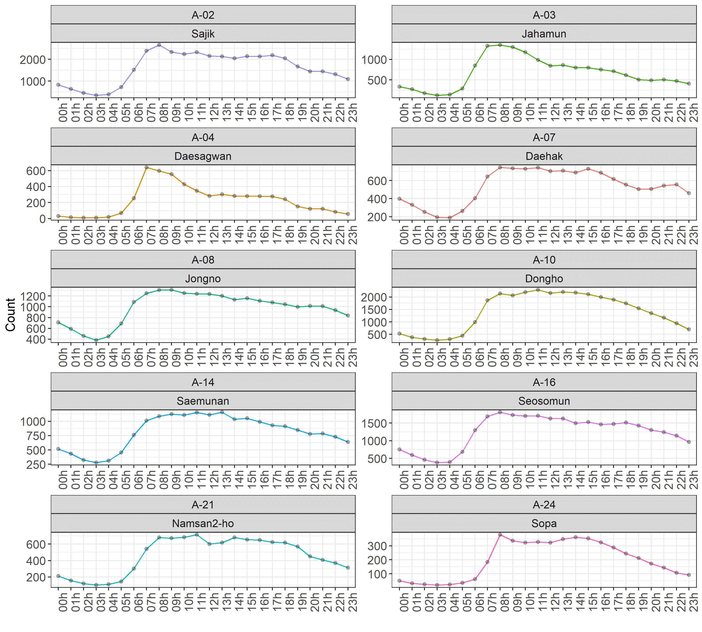

# Study Area and Data Collection
## Study Area
The study area for this chapter covers most parts of the Jung and Jongno districts (16.6km<sup>2</sup>) which is the CBD of Seoul. This CBD zone is also referred to as the “Sadaemoon” area, known as the four gates named by the previous monarchy. There are eight sub-districts^[Sajik, Cheongwoonhyoja, Samcheong, Gahoe, Jongno 1-4ga, Jongno 5-6ga, Ewha, and Hyewha] in the Jongno district and seven sub-districts^[Sogong, Hoehyeon, Myung, Pil, Jangchoong, Gwanghee, and Euljiro] in Jung. This area plays a central role in business, tourism, shopping, and transit to sub-civic centres.

To improve urban air quality, Seoul planned a Green Transport Scheme which set a clean air zone within the four gates of central Seoul. Unlike London’s ULEZ (Ultra Low Emission Zone), the government has fined vehicles that do not meet the emission standards since December 2019. Despite the attempt to provide better air quality for citizens and commuters, there are still concerns about whether the reduced traffic has benefited air quality since the commencement of peak hours, or has caused another problem for those drivers whose vehicles do not meet the standard who coercively have to change their mode of transport.

Seoul CBD was chosen because first, approximately 300,000 people and 1.3 million vehicles commute to the area every day, second, direct and indirect effects from the exhaust and non-exhaust emissions release notorious levels of particulates which can affect residents' and commuters' health, and lastly, hardly any scientific studies have discovered the association between vehicle ban and air quality after the 'Green Transport Scheme' was initiated. More TRAP studies, such as London Low Emission Zone (LEZ) are needed [@Kelly2011a; @Beevers2013a; @Beevers2016; @Halonen2016d].


<div class="figure">

<p class="caption">(\#fig:study-area)Study area - Seoul Central Business District. This area includes Jongno and Jung districts</p>
</div>

## Air Pollution

Hourly measured PM<sub>10</sub> was imported from two urban background stations, Jongno and Jung, and two roadside stations, Jongno and Seoul Station, provided by the National Institute of Environmental Research. Assuming subway commuters travel outside the CBD area, PM<sub>10</sub> was also collected and averaged from 23 background and 12 roadside stations within the city boundary. The collection period was set between January 1st-March 31st, 2018, considering high concentrations and variations of PM<sub>10</sub> during the winter period. The study chose the three months for which the data were available in the Seoul Institute repository.


In January, Seoul Station (58.2±33.7µg/m<sup>3</sup>) had more PM<sub>10</sub> than the other stations by 11-14µg/m<sup>3</sup> on average (Jung: 44.6±23.9µg/m<sup>3</sup>, Jongno: 44.8±24.3µg/m<sup>3</sup>, Jongno Road: 47.3±6µg/m<sup>3</sup>). The concentrations in February and March were comparable at all stations, where PM<sub>10</sub> at Jongno, Jung, and Jongno Road ranged between 45-47µg/m<sup>3</sup> in February, and 45-49µg/m<sup>3</sup> in March, while Seoul station had 63.1µg/m<sup>3</sup> in February and 64.6µg/m<sup>3</sup> in March 2018. Jongno Road reported amounts just 1-2µg/m<sup>3</sup> higher than the background stations which was unexpectedly low for a roadside station during the same period.


Despite a monthly average maintaining between 40-60µg/m<sup>3</sup>, major PM<sub>10</sub> episodes were observed across all sites in mid-January, early and late February, and in mid and late March (see Figure 2). Furthermore, South Korea’s PM<sub>10</sub> guideline of 100µg/m<sup>3</sup> was exceeded by 302 hours at Seoul Station (14%), 133 hours at Jongno roadside (6.1%), 117 hours at Jongno background (5.3%), and 104 hours at Jung background (4.8%) (see Table \@ref(tab:table1)).


<div class="figure" style="text-align: center">

<p class="caption">(\#fig:pollution-trend)A comparison of Hourly measured PM<sub>10</sub> between the background and roadside stations. The smooth lines (rolling average) inform that the Seoul station (purple) was 16µg/m<sup>3</sup> higher than the other stations. The largest difference was observed on January the 20th, with 247µg/m<sup>3</sup> reported on the kerbside and 171µg/m<sup>3</sup> on the background.</p>
</div>


```{=html}
<template id="bb3e3faa-c374-4295-a723-86d58b000084"><style>
.tabwid table{
  border-spacing:0px !important;
  border-collapse:collapse;
  line-height:1;
  margin-left:auto;
  margin-right:auto;
  border-width: 0;
  display: table;
  margin-top: 1.275em;
  margin-bottom: 1.275em;
  border-color: transparent;
}
.tabwid_left table{
  margin-left:0;
}
.tabwid_right table{
  margin-right:0;
}
.tabwid td {
    padding: 0;
}
.tabwid a {
  text-decoration: none;
}
.tabwid thead {
    background-color: transparent;
}
.tabwid tfoot {
    background-color: transparent;
}
.tabwid table tr {
background-color: transparent;
}
</style><div class="tabwid"><style>.cl-a7d278e8{}.cl-a7cf98c6{font-family:'Helvetica';font-size:11pt;font-weight:normal;font-style:normal;text-decoration:none;color:rgba(0, 0, 0, 1.00);background-color:transparent;}.cl-a7cfa4ba{margin:0;text-align:left;border-bottom: 0 solid rgba(0, 0, 0, 1.00);border-top: 0 solid rgba(0, 0, 0, 1.00);border-left: 0 solid rgba(0, 0, 0, 1.00);border-right: 0 solid rgba(0, 0, 0, 1.00);padding-bottom:5pt;padding-top:5pt;padding-left:5pt;padding-right:5pt;line-height: 1;background-color:transparent;}.cl-a7cfa4bb{margin:0;text-align:right;border-bottom: 0 solid rgba(0, 0, 0, 1.00);border-top: 0 solid rgba(0, 0, 0, 1.00);border-left: 0 solid rgba(0, 0, 0, 1.00);border-right: 0 solid rgba(0, 0, 0, 1.00);padding-bottom:5pt;padding-top:5pt;padding-left:5pt;padding-right:5pt;line-height: 1;background-color:transparent;}.cl-a7cfc256{width:54pt;background-color:transparent;vertical-align: middle;border-bottom: 0 solid rgba(0, 0, 0, 1.00);border-top: 0 solid rgba(0, 0, 0, 1.00);border-left: 0 solid rgba(0, 0, 0, 1.00);border-right: 0 solid rgba(0, 0, 0, 1.00);margin-bottom:0;margin-top:0;margin-left:0;margin-right:0;}.cl-a7cfc257{width:54pt;background-color:transparent;vertical-align: middle;border-bottom: 0 solid rgba(0, 0, 0, 1.00);border-top: 0 solid rgba(0, 0, 0, 1.00);border-left: 0 solid rgba(0, 0, 0, 1.00);border-right: 0 solid rgba(0, 0, 0, 1.00);margin-bottom:0;margin-top:0;margin-left:0;margin-right:0;}.cl-a7cfc258{width:54pt;background-color:transparent;vertical-align: middle;border-bottom: 2pt solid rgba(102, 102, 102, 1.00);border-top: 0 solid rgba(0, 0, 0, 1.00);border-left: 0 solid rgba(0, 0, 0, 1.00);border-right: 0 solid rgba(0, 0, 0, 1.00);margin-bottom:0;margin-top:0;margin-left:0;margin-right:0;}.cl-a7cfc260{width:54pt;background-color:transparent;vertical-align: middle;border-bottom: 2pt solid rgba(102, 102, 102, 1.00);border-top: 0 solid rgba(0, 0, 0, 1.00);border-left: 0 solid rgba(0, 0, 0, 1.00);border-right: 0 solid rgba(0, 0, 0, 1.00);margin-bottom:0;margin-top:0;margin-left:0;margin-right:0;}.cl-a7cfc261{width:54pt;background-color:transparent;vertical-align: middle;border-bottom: 2pt solid rgba(102, 102, 102, 1.00);border-top: 2pt solid rgba(102, 102, 102, 1.00);border-left: 0 solid rgba(0, 0, 0, 1.00);border-right: 0 solid rgba(0, 0, 0, 1.00);margin-bottom:0;margin-top:0;margin-left:0;margin-right:0;}.cl-a7cfc262{width:54pt;background-color:transparent;vertical-align: middle;border-bottom: 2pt solid rgba(102, 102, 102, 1.00);border-top: 2pt solid rgba(102, 102, 102, 1.00);border-left: 0 solid rgba(0, 0, 0, 1.00);border-right: 0 solid rgba(0, 0, 0, 1.00);margin-bottom:0;margin-top:0;margin-left:0;margin-right:0;}</style><table class='cl-a7d278e8'>
```
<caption class="">

(\#tab:table1)Number of times each station exceeded the hourly standard of 100µg/m<sup>3</sup>

</caption>
```{=html}
<thead><tr style="overflow-wrap:break-word;"><td class="cl-a7cfc262"><p class="cl-a7cfa4ba"><span class="cl-a7cf98c6">Month</span></p></td><td class="cl-a7cfc261"><p class="cl-a7cfa4bb"><span class="cl-a7cf98c6">Jongno (back)</span></p></td><td class="cl-a7cfc261"><p class="cl-a7cfa4bb"><span class="cl-a7cf98c6">Jung (road)</span></p></td><td class="cl-a7cfc261"><p class="cl-a7cfa4bb"><span class="cl-a7cf98c6">Jongno (road)</span></p></td><td class="cl-a7cfc261"><p class="cl-a7cfa4bb"><span class="cl-a7cf98c6">SeoulStation (kerb)</span></p></td></tr></thead><tbody><tr style="overflow-wrap:break-word;"><td class="cl-a7cfc257"><p class="cl-a7cfa4ba"><span class="cl-a7cf98c6">Jan</span></p></td><td class="cl-a7cfc256"><p class="cl-a7cfa4bb"><span class="cl-a7cf98c6">34</span></p></td><td class="cl-a7cfc256"><p class="cl-a7cfa4bb"><span class="cl-a7cf98c6">34</span></p></td><td class="cl-a7cfc256"><p class="cl-a7cfa4bb"><span class="cl-a7cf98c6">42</span></p></td><td class="cl-a7cfc256"><p class="cl-a7cfa4bb"><span class="cl-a7cf98c6">88</span></p></td></tr><tr style="overflow-wrap:break-word;"><td class="cl-a7cfc257"><p class="cl-a7cfa4ba"><span class="cl-a7cf98c6">Feb</span></p></td><td class="cl-a7cfc256"><p class="cl-a7cfa4bb"><span class="cl-a7cf98c6">21</span></p></td><td class="cl-a7cfc256"><p class="cl-a7cfa4bb"><span class="cl-a7cf98c6">18</span></p></td><td class="cl-a7cfc256"><p class="cl-a7cfa4bb"><span class="cl-a7cf98c6">25</span></p></td><td class="cl-a7cfc256"><p class="cl-a7cfa4bb"><span class="cl-a7cf98c6">91</span></p></td></tr><tr style="overflow-wrap:break-word;"><td class="cl-a7cfc257"><p class="cl-a7cfa4ba"><span class="cl-a7cf98c6">Mar</span></p></td><td class="cl-a7cfc256"><p class="cl-a7cfa4bb"><span class="cl-a7cf98c6">62</span></p></td><td class="cl-a7cfc256"><p class="cl-a7cfa4bb"><span class="cl-a7cf98c6">52</span></p></td><td class="cl-a7cfc256"><p class="cl-a7cfa4bb"><span class="cl-a7cf98c6">66</span></p></td><td class="cl-a7cfc256"><p class="cl-a7cfa4bb"><span class="cl-a7cf98c6">123</span></p></td></tr><tr style="overflow-wrap:break-word;"><td class="cl-a7cfc260"><p class="cl-a7cfa4ba"><span class="cl-a7cf98c6">Total</span></p></td><td class="cl-a7cfc258"><p class="cl-a7cfa4bb"><span class="cl-a7cf98c6">117</span></p></td><td class="cl-a7cfc258"><p class="cl-a7cfa4bb"><span class="cl-a7cf98c6">104</span></p></td><td class="cl-a7cfc258"><p class="cl-a7cfa4bb"><span class="cl-a7cf98c6">133</span></p></td><td class="cl-a7cfc258"><p class="cl-a7cfa4bb"><span class="cl-a7cf98c6">302</span></p></td></tr></tbody></table></div></template>
<div class="flextable-shadow-host" id="e2efb3f7-6e46-4003-8c24-ab9a7eeb7c18"></div>
<script>
var dest = document.getElementById("e2efb3f7-6e46-4003-8c24-ab9a7eeb7c18");
var template = document.getElementById("bb3e3faa-c374-4295-a723-86d58b000084");
var caption = template.content.querySelector("caption");
if(caption) {
  caption.style.cssText = "display:block;text-align:center;";
  var newcapt = document.createElement("p");
  newcapt.appendChild(caption)
  dest.parentNode.insertBefore(newcapt, dest.previousSibling);
}
var fantome = dest.attachShadow({mode: 'open'});
var templateContent = template.content;
fantome.appendChild(templateContent);
</script>

```


## Population
To investigate the dynamics of instantaneous exposure to PM<sub>10</sub> by different commute patterns, subway commuters and resident drivers were compared. To obtain an adequate population for both groups, this study separated the approaches for data collection. The use of sampled agents was to maintain the computation speed and the health risk rate which did not change to a large extent when the sample size was bigger.


For subway commuters, 1% of the census and the daytime population of Jongno and Jung districts were imported from national statistics. To obtain a closer estimate for subway commuters, this study attempted to subtract the daytime population by the census, then multiply the fraction of subway users. Here, Jongno and Jung had 147,607 persons and 118,632 persons reported on the census, and 392,128 persons and 442,225 persons for the daytime population. This can be summed up to 266,239 persons and 834,353 persons respectively. Daytime population subtracted by the census equals 568,114 persons. This can be multiplied by the rate of subway commuters (34%) which returns 193,159 persons. Hence, the model imported 1% of the final population of 1932 agents in the simulation. 


It is worth noting that the rate of subway commuters was provided by the Korean Transport Database that surveyed transport modes used for commuting to the destined admin zone during weekdays, which offers counts of transport modes taken from the participant rather than considering the total number of transit taken from a single person. For example, a participant who took a taxi and the subway would have answered both.


For resident vehicles, each sub-district was provided with a sum of vehicles by fuel type that includes gasoline, diesel, LPG, Hybrid, and so on (Seoul Statistics Office, 2019). Having excluded the vehicles whose administration zone had recently incorporated with others due to population change, a final sample of 399 registered vehicles, close to a 5% sample, were imported for simulation. 


## Traffic Count
Traffic count data was provided by the Transport Operation & Information Service (TOPIS) of the Seoul Metropolitan Government, with the intention to implement the influx of non-resident vehicles into the study area. The statistics were recorded on an hourly basis at 24 observation points that start with A01, A02, and so on (see Figure \@ref(fig:traffic-map)). The attributes include dates, hours, flow directions, and road names. To get accurate counts of data but to avoid duplication with closer stations, 10 stations were imported into the simulation: A02, A03, A04, A07, A08, A09, A10, A12, A20, A24.


Since the model uses ‘minutes’ as a temporal unit, the hourly traffic counts were decomposed and rounded to the nearest minute. For example, on the 3rd of January 2018 at 8:00-9:00am, there were 3,075 inbound vehicles at A-02 (Sajik road), which was divided by 60, and resulted in 51 vehicles per minute on average that flowed into the study area. 

<div class="figure">

<p class="caption">(\#fig:traffic-map)Traffic count monitors around the CBD area from A01-A24</p>
</div>


Figure \@ref(fig:traffic-hourly) illustrates the average vehicle counts by the hour of the day between January-March 2018. The figures are the summation of traffic in both directions. As seen from the hourly data during the study period, a rapid increase occurred between 4:00-8:00 where the numbers soared from 250 to 1250 each hour. The count slowly decreased from 9:00 but maintained above 1000 cars per hour until 17:00; then continued to decline until 3:00.


<div class="figure">

<p class="caption">(\#fig:traffic-hourly)Average traffic count of the CBD stations by the hours of the day (January-March, 2018). The numbers were added from both directions.</p>
</div>


To understand the volume of the traffic by road, the total counts were decomposed by each road. In Figure \@ref(fig:traffic-hourly2), Sajik and Dongho roads have the highest volume of all with over 2000 during the working hours, followed by Jongno, Samunan and Seosomun roads that had over 1100 vehicles per hour at the same time. Sopa and Daesagwan were the quieter roads in the CBD that mostly remained at around 200-500 vehicles per hour.

<div class="figure">

<p class="caption">(\#fig:traffic-hourly2)Hourly traffic counts by 10 CBD road checkpoints</p>
</div>


## OD Matrix
We used an annual daily average of OD matrix 2015 provided by the Korean Transport database. A mode-based matrix from 2015 was selected over a purpose-based matrix because the study focuses on the journey by transport modes. For example, the population of Sajik heading to Jongno taking subways are approximately 38,541 persons.


Amongst 15 modes of transport^[Walking, passenger car, carpooled people, city bus, regional bus, town bus, intercity bus, express bus, other buses, subway, rail, speed rail, taxi, small freight, large freight, motorbike, bicycle, and others], we took the counts of passenger cars as proxy data to assign the origins and destinations for resident agents. As the model is not suitable to implement the entire population, we converted the raw OD matrix to a fractional OD matrix to assign the agents irrespective of sample sizes. Note that the boundaries of the administrative area in 2015 might not always match the boundaries of the daytime population or vehicle registration zones in 2018 due to rapid population change that resulted from urban regeneration and gentrification. The OD matrix for subway commuters is omitted because the destinations at the subdistrict level were already assigned in the setup.


The fraction of OD data simply filters the counts of passenger cars and converts to a scale of 0-1. As mentioned earlier, there is a mismatch of administrative codes between the year the vehicle counts were collected and the year that the OD matrix was generated, in other words, some admin codes were in 2015 are missing in 2018. The result is shown in Table 3.


It is worth raising the caveat of using a fractional OD matrix that matches the data too exactly when using a subsample of the population: an accumulation error may occur that gives a sum more than the total number of agents that exist. In mathematics, the so-called rounding error or floating-point precision error occurs when “the result produced by a given algorithm using exact arithmetic and the result produced by the same algorithm using finite-precision, rounded arithmetic.” [@Ueberhuber1997]. In this model, this occurs when the counts of the allocated agents (by origin/destination) are larger than the counts of the agents. The opposite would not be a problem because the agents can be given another arbitrary destination or perhaps be removed. 


For example, 33 agents of origin 1101053 will be allocated to each sub-district including itself. The model will calculate 33×0.19, then 33×0.01 (see Table 3), and so on, which will total 30. As mentioned, the three agents that do not have an allocation can be allocated to an arbitrary destination but were removed for this study. However, in two sub-districts, 1101060 and 1102058, each sub-district had 10 agents, but the arithmetic results returned 11 agents and 13 agents. To avoid these computational problems float values were reduced until the error disappeared. The adjustment might seem arbitrary but is necessary for model consistency and the difference of agents would not be too problematic as it would not noticeably change the emission levels. 


